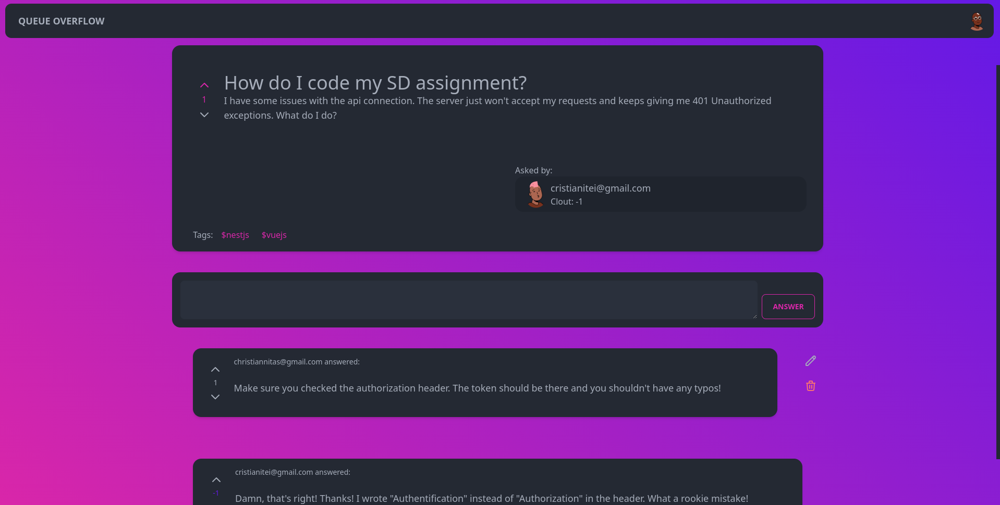
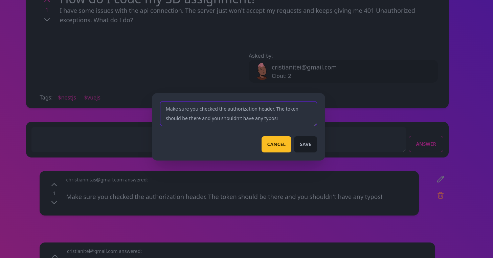

<p align="center">
  
  <h1 align="center">QUEUE OVERFLOW</h1>
</p>

## Instalation

Make sure that you have node installed before attempting to run this project. After you installed node, you can run the bellow command in the root folder of the project to install all of the dependencies.

```bash
$ npm install
```

You also need to have an instance of maria DB to connect to, as well as a test database. The database can be
configured in the [main module of the application](./src/app.module.ts).

You can generate and seed a test database by running [this script](./dbdump.sql). This database will contain two already created users:

- A normal user with email: `testuser@gmail.com` and password `testpassword`
- A moderator user with email: `testmoderator@gmail.com` and password `testpassword`
- A normal user with email: `testotheruser@gmail.com` and password `testpassword`

## Running the app

After installing the dependencies and having configured the database, you can run the backend on localhost using any of the bellow commands. By default, the app will listen on port `3000`.

```bash
# development
$ npm run start

# watch mode
$ npm run start:dev

# production mode
$ npm run start:prod
```

# Sturucture of the Database

The database contains 7 tables to persist and connect all our data our app requires.

<p align="center">

</p>

# Structure of the project.

The project is structured according to a layered architecture. The Controllers layer handles the comunication with the outside world. Its repsonsibility is to route incoming requests to the proper controllers and to make useful calls to the service layer in order to return the requested resources or initiate the operations.

The service layer contains the business logic of our API. It handles all the business operations and implements the functionality we need from our API.

The Data access layer performs the communication with the database. It handles data persistance and querying through the repository pattern.
<p align="center">

</p>

Not mentioned here are the entities that NestJS generates. In the ODM, these entities are persisted to the database but they are accessible from any layer. They are also useful in the service layer, because they also act as our app's Models.

To easely access all the resources any component in any layer needs, nestJS implements a powerful and flexible dependency injection and scoping system. This is done by grouping every domain in our application in a module. Every module has four components:

- **Imports:** define the resources that come from outside the module 
- **Exports:** define the resources that can be imported by other modules.
- **Providers:** define the providers (services / helpers / etc...) that can be imported by other modules.
- **Controllers:** define the controllers that our module exports to the app.

Our app is characterized by six main domains or functionalities:

- **Users**: Handles all CRUD operations regarding users
- **Questions**: Handles all CRUD operations regarding questions 
- **Answers**: Handles all CRUD operations regarding answers. 
- **Tags**: Handles tag fetching and creation.
- **Votes**: Handles the votes system operations (like / dislike answers or questions)
- **Auth**: Handles authentification and authorization operations.

# Modules

## Users

The users module handles the operations on the users of our application. A user has the following entity [structure](./src/users/entities/user.entity.ts):

- **id**: An unique identifier for the database.
- **email**: Email the user registered with.
- **passwordHash**: The hash of the password the user registered with.
- **role**: The role of the user. Can be either `NORMAL` or `MODERATOR`.
- **score**: The score of the user.

The diagram of this module is the following:

<p align="center">
  
</p>

You can notice the layered architecture where the controller only interacts with the user service, while the service interacts with the repository ant returns the results of its operations back to the controller. The user DTOs are data transfer objects that model the body of our requests. for example the [dto for creating a user](./src/users/dto/create-user.dto.ts) has the following fields which must appear in the body of the POST request.

```typescript
export class CreateUserDto {
  @IsNotEmpty()
  @IsEmail()
  @IsString()
  email: string;

  @IsNotEmpty()
  @MinLength(8)
  password: string;

  @IsNotEmpty()
  role: UserRole;
}
```
The decorators used in the definition serve for data validation.

## Endpoints

<p class="get">GET</p> localhost:3000/users

### Retrieves all the registered users

Sample output
```JSON
[
  {
      "id": 4,
      "email": "testuser@gmail.com",
      "role": "normal"
  },
  {
      "id": 5,
      "email": "testmoderator@gmail.com",
      "role": "moderator"
  }
]
```
<p class="get">GET</p> localhost:3000/users/:id

### Retrieves a registered user based on his id.

> id: the id of the user to be retrieved

- Can return `NOT_FOUND` if the user doesn't exist

Sample output
```JSON
{
    "id": 4,
    "email": "testuser@gmail.com",
    "role": "normal"
}
```

<p class="post">POST</p> localhost:3000/users

### Given a body, creates a user in the database. Returns the created user object.

- Can return `BAD_REQUEST` if body is improperly formated.

- Method can be accessed without a Bearer Token.

Sample **body**
```JSON
{
    "email": "testuser@gmail.com",
    "password": "testpassword",
    "role": "normal"
}
```
Sample output
```JSON
{
    "id": 4,
    "email": "testuser@gmail.com",
    "role": "normal"
}
```

<p class="patch">PATCH</p> localhost:3000/users/:id

### Given a body, and id, updates the user in the database.

> id: the id of the user to be retrieved

- Can return `NOT_FOUND` if id doesn't match any user

- Can return `BAD_REQUEST` if body is improperly formated.

- Method can return `FORBIDDEN` if user is not a `MODERATOR`

Sample **body**
```JSON
{
    "email": "testuser@gmail.com",
    "role": "moderator"
}
```
> If exectued sucessfuly, returns OK (200)

<p class="delete">DELETE</p> localhost:3000/users/:id

### Given an id. It will delete a user in the database.

> id: the id of the user to be deleted

- Method can return `FORBIDDEN` if user is not a `MODERATOR`

> If exectued sucessfuly, returns OK (200) 

## Auth

The auth module handles authentification. The user can use local authentification where he must provide a username and password on every request, or he can log in and get a JWT token from the login route.

<p align="center">
  
</p>

Guards are decorators tha can be applied to endpoints to decide wheter a request is routed to that controller or not. Here, the auth module exports JWT and local guards to be used globally.

These guards will act as protectors of our endpoints. If on a non-`Public` endpoint you don't provide a valid JWT token, it will return an `UNAUTHORIZED` response.

## Endpoints

<p class="post">POST</p> localhost:3000/auth/login

### Given a username and password, will log the user in and return a JWT

- Can return `BAD_REQUEST` if body is improperly formated.

- Method can be accessed without a Bearer Token.

Sample **body**
```JSON
{
    "username": "testuser@gmail.com",
    "password": "testpassword",
}
```
Sample output
```JSON
{
    "token": "aihsbduahbsdoiuhanwhdbaiksjbndkajhsdasdmkoanoi3uw4h92187u3bd"
}
```

<p class="get">GET</p> localhost:3000/auth/self

### Returns the self user object.

- Can return `BAD_REQUEST` if body is improperly formated.

Sample output
```JSON
{
    "id": 4,
    "email": "testuser@gmail.com",
    "role": "normal"
}
```

## Questions

The questions module handles CRUD operations on questions. The user can create, retrieve questions, update a question or delete it if he is an `MODERATOR`. It relies on the Tags module as well for creation and persistance of tags.

The tags service exposes a single method that will search a list of tags in the database. If a tag in that list does not exist in the database, it will be created.

The questions service also depends on the user service to be able to link a question with its author based on an id. This is a many to one relationship because an author can have multiple questions while a question can have only one author.

<p align="center">
  
</p>

## Endpoints

<p class="get">GET</p> localhost:3000/questions

### Retrieves all the questions ordered by date of creation descendingly.

Sample output
```JSON
[
    {
        "id": 3,
        "title": "haha?",
        "text": "fo realzies???",
        "createdAt": "2022-03-15T20:36:04.000Z",
        "clout": 0,
        "author": {
            "id": 4,
            "email": "testuser@gmail.com",
            "passwordHash": "$2b$10$iPstnmNDf9L/cwWeqJBzVOmpomRMpu1CkBPvlMuG/QQG2YFzjicgu",
            "role": "normal",
            "score": 17
        },
        "tags": [
            {
                "identifier": "life"
            }
        ]
    },
    {
        "id": 2,
        "title": "How do I code my SD assignment?",
        "text": "yes",
        "createdAt": "2022-03-15T20:32:29.000Z",
        "clout": -1,
        "author": {
            "id": 1,
            "email": "mathildagray@gmail.com",
            "passwordHash": "$2b$10$hfvnohSbPEUgQ4WKowd2xe/4a5K8SzESOGxVJp9tEXvlxrsdnXUAq",
            "role": "normal",
            "score": -2
        },
        "tags": [
            {
                "identifier": "nestjs"
            },
            {
                "identifier": "softwaredesign"
            }
        ]
    }
]
```
<p class="get">GET</p> localhost:3000/questions/:id

### Retrieves a question based on its id.

> id: the id of the user to be retrieved

- Can return `NOT_FOUND` if the question doesn't exist

Sample output
```JSON
{
    "id": 2,
    "title": "How do I code my SD assignment?",
    "text": "yes",
    "createdAt": "2022-03-15T20:32:29.000Z",
    "clout": -1,
    "author": {
        "id": 1,
        "email": "mathildagray@gmail.com",
        "passwordHash": "$2b$10$hfvnohSbPEUgQ4WKowd2xe/4a5K8SzESOGxVJp9tEXvlxrsdnXUAq",
        "role": "normal",
        "score": -2
    },
    "tags": [
        {
            "identifier": "nestjs"
        },
        {
            "identifier": "softwaredesign"
        }
    ]
}
```

<p class="get">GET</p> localhost:3000/questions/title/:title

### Retrieves all the questions ordered by date of creation descendingly that partially match the provided parameter.

> title: a partial string to be retrieved. 

> Output is similar to previous requests.


<p class="get">GET</p> localhost:3000/questions/tag/:tag

### Retrieves all the questions ordered by date of creation descendingly which have the specified tag.

> tag: the id of the searched tag. 

> Output is similar to previous requests.

<p class="post">POST</p> localhost:3000/questions

### Given a body, creates a new question.

- Can return `BAD_REQUEST` if body is improperly formated.

> The author id can be **ommited** because it can be extracted from the Bearer token.

Sample **body**
```JSON
{
    "title": "How do I code my SD assignment?",
    "text": "Ok, so i'm kind of confused on how do I code stuff on...",
    "tags": [
        "softwaredesign",
        "nestjs"
    ]
}
```
Sample output
```JSON
{
    "text": "Ok, so i'm kind of confused on how do i code certain aspects of my SD assigment...asda",
    "title": "How do I code my SD assignment?",
    "tags": [
        {
            "identifier": "softwaredesign"
        },
        {
            "identifier": "nestjs"
        }
    ],
    "answers": [],
    "author": {
        "id": 5,
        "email": "testmoderator@gmail.com",
        "passwordHash": "$2b$10$4G5cMl9Exooy6PDQHTglqOmIOs6P0dugU8VYb79jWNbiZ7vQLA8bm",
        "role": "moderator",
        "score": 0
    },
    "id": 4,
    "createdAt": "2022-03-16T01:27:50.000Z",
    "clout": 0
}
```

<p class="patch">PATCH</p> localhost:3000/question/:id

### Given a body, and id, updates the user in the database.

> id: the id of the user to be retrieved

- Can return `NOT_FOUND` if id doesn't match any question

- Can return `BAD_REQUEST` if body is improperly formated.

- Method can return `FORBIDDEN` if user is not a `MODERATOR` or `THE AUTHOR OF THE QUESTION`

Sample **body**
```JSON
{
    "text": "... **fixed typo sry"
}
```
> If exectued sucessfuly, returns OK (200)

<p class="delete">DELETE</p> localhost:3000/questions/:id

### Given an id. It will delete a question in the database.

> id: the id of the user to be deleted

- Can return `NOT_FOUND` if id doesn't match any question

- Method can return `FORBIDDEN` if user is not a `MODERATOR`

> If exectued sucessfuly, returns OK (200) 


## Answers

The answers are stored as a one to many relationship in the database. Each question can have many answers, but an answer can have only one question. When we retrieve a question, we will attach its answers with it, so we do not have to create an endpoint in this module for retrieving the answers of a question.

The diagram for the answers is similar to the one from the questions module. It only depends on the user and the questions service to be able to construct its relations.


<p align="center">
  
</p>

## Endpoints


<p class="post">POST</p> localhost:3000/answers

### Given a body, creates a new answer.

- Can return `BAD_REQUEST` if body is improperly formated.

- Can return `NOT_FOUND` if provided question doesn't exist.

> The author id can be **ommited** because it can be extracted from the Bearer token.

Sample **body**
```JSON
{
    "question": 2,
    "text": "NOOO, u can't use typescript. It's slow and bloated!!!11! and it sucks! Use the right eNtErpRisE tOOl!!! https://spring.io/"
}
```
Sample output
```JSON
{
    "text": "NOOO, u can't use typescript. It's slow and bloated!!!11! and it sucks! Use the right eNtErpRisE tOOl!!! https://spring.io/",
    "author": {
        "id": 5,
        ...
    },
    "question": {
        "id": 2,
        ...
    },
    "id": 4,
    "clout": 0,
    "createdAt": "2022-03-16T01:40:40.000Z"
}
```
<p class="patch">PATCH</p> localhost:3000/answers/:id

### Given a body, and id, updates the answer in the database.

> id: the id of the user to be retrieved

- Can return `NOT_FOUND` if id doesn't match any answer

- Can return `BAD_REQUEST` if body is improperly formated.

- Method can return `FORBIDDEN` if user is not a `MODERATOR` or `THE AUTHOR OF THE QUESTION`

Sample **body**
```JSON
{
    "text": "Best thing is NestJs! Trust me bro! I'm based: https://docs.nestjs.com/"
}
```
> If exectued sucessfuly, returns OK (200)

<p class="delete">DELETE</p> localhost:3000/answers/:id

### Given an id. It will delete a answer in the database.

> id: the id of the answer to be deleted

- Can return `NOT_FOUND` if id doesn't match any answer

- Method can return `FORBIDDEN` if user is not a `MODERATOR` or `THE AUTHOR OF THE ANSWER`

> If exectued sucessfuly, returns OK (200) 

## Votes

The votes module handles the voting functionality. You can vote answers and questions, but you cannot vote on your own answers and questions. For every vote, the user's score which you voted will be altered and maybe the voting users as well.


<p align="center">
  
</p>

The votes module has only two POST endpoints.

<p class="post">POST</p> localhost:3000/votes/question

### Given a body, creates a new QuestionVote and updates the scores of the users and clout of the question.

- Can return `NOT_FOUND` if id doesn't match any question

- Can return `BAD_REQUEST` if body is improperly formated.

- Method can return `FORBIDDEN` if voting user is `THE AUTHOR OF THE QUESTION`

> The voting user can be **ommited** because it can be extracted from the Bearer token.

> The voted user can be **ommited** because it can be extracted from the question object.

Sample **body**
```JSON
{
    "questionId": 2,
    "amount": -1
}
```
> On success, returns the clout of the voted question

<p class="post">POST</p> localhost:3000/votes/answer

### Given a body, creates a new AnswerVote and updates the scores of the users and clout of the answer.

- Can return `NOT_FOUND` if id doesn't match any answer

- Can return `BAD_REQUEST` if body is improperly formated.

- Method can return `FORBIDDEN` if voting user is `THE AUTHOR OF THE ANSWER`

> The voting user can be **ommited** because it can be extracted from the Bearer token.

> The voted user can be **ommited** because it can be extracted from the question object.

Sample **body**
```JSON
{
    "answerId": 2,
    "amount": -1
}
```
> On success, returns the clout of the voted answer

<p class="get">GET</p> localhost:3000/votes/?question=questionid&answer=answerid

### Given a query consisting of a question id or an answer id and a user id, it returns wether there exists a vote on that particular question or answer by the specified user.

- Can return `BAD_REQUEST` if query is missing `answer` and `question` 

> The voting user can be **ommited** because it can be extracted from the Bearer token.

Sample **body**
```JSON
{
    "isLiked": true
}
```
> On success, returns an object with a single field called `isLiked` which can be either true, false or undefined.


<p align="center">
  
  <h1 align="center">QUEUE OVERFLOW</h1>
</p>


## Instalation

Make sure that you have node installed before attempting to run this project. After you installed node, you can run the bellow command in the root folder of the project to install all of the dependencies.

```bash
$ npm install
```

You also need to have the backend instance running and reachable from the device. Once you have everything running, you can run the following command to start the vite service on port 3000.

```
$ npm run dev 
```
Now the webpage should be available on localhost:3000.

## Structure

The project was built with vue 3. Every vue 3 project has a main document, where the app is assembled. This particular app was built using the typescript language, and therefore, all sources are written in typescript and transpiled to Javascript on run.

### App.vue

In vue 3, the webpage is structured on components. Components can have subcomponents and so on creating a tree like structure of HTML code combined with localized typescript code.

The root component of any vue app is the App component. This component is instantiated in the main.ts file and mounted onto the index.html.

The root component contains the main view of the application and it acts as a frame, where components which appear on all pages are created, for instance, the navbar component.

<p align="center">

<p/>

In the app component, we also set up the routing system which will handle the transitions between pages. This is done through the `<router-view>` component which will replace its child with the current page.

Here, we also create the modal components like the update answer dialog which does not really belong to any component in particular and should be treated as an independent component spawned when needed. The component is made visible to the user when any part of the application requires it.

## Pages

The app contains several pages for displaying content. Each page is in essence a vue component, containing its own mostly isolated logic for displaying the model it is supposed to, or fulfilling its functionality.

### Login

The first component any user meets is the login page, where he can type in his credentials and he can log in to the system. This page has a sub-component which is the login dialog where the user can enter his email and password and he can press the login button to send a request to the backend and receive back a token which verifies his identity. This token will be persisted in our `AuthService` which will be tasked with providing identity related information to our app. For example, the navbar has an icon for the user where he can access his profile or log out. This icon is only visible when the user is logged in, so we can look towards the `Auth service` to provide our app with the flag if the user is logged in or not.

<p align="center">

<p/>

### Home

Once the user is logged in, we enter the home page of our app where we can see all the questions asked on the site in order of their creation. When this page is loaded, the Home page logic makes calls the load questions function on the `Questions Service` and awaits for the questions to come from the backend. It also takes the reference of the array of questions and will build a `QuestionCard` component for each question in the array.


<p align="center">

<p/> 

Above the list of questions there is a text field input where the user can type any question or any tag and can search it in the backend of our app. Besides this input there is the `ASK NEW` button which once clicked will open a new card which contains several inputs to create a new question on the site. Once the question is created, it will appear in the list.


<p align="center">

<p/> 

In the bottom left input, the user can type in any tag he wants to add to the question. While he types, a list of recommendations appears underneath with already existing tags in the database. He can click the arrow button, and the tags for the question will appear as chips to the right. If he wishes to remove a tag, he can click the X button in the left part of any chip.

<p align="center">

<p/> 

### Search

The user can also search questions in the database. He can either type a keyword contained in the title of the question or he can start his search with the `$` character in order to search for a particular tag.

Once he hits the search button he will be taken to the search page where a list of the results will be displayed:

<p align="center">

<p/> 

<p align="center">

<p/> 

### Question

The question page is meant to display a single question and all of its answers. It will have a detailed view of the question asked, the text, the author and the tags associated with it. Underneath, there exists a card which users can use to add an answer to the question and underneath that card are all the previous answers.

If any of the answers was created by the current user, to its right are two buttons for editing and deletion of the answer. The user can like and dislike a question or any answers which are not his.

<p align="center">

<p/> 

The page has the URL of `localhost:3000/question/5` where question denotes the page we are on and 5 is the id of the viewed question. On load, this page will ask the `Questions Service` to provide it with a Question object to display. The service will then ask the backend for the question and will return all the information on it, including the answers by all the users. Then, for each answer and for the question, it will perform a query to see if any of the answers or questions are liked by the current user and will display the like and dislike buttons accordingly.

### Profile

On the previous page, the user can click on the little card in the right of the question with the information of the author and they will be taken to the profile page. Like in the previous page, the id of the viewed user is present in the url, so even if the user views his own profile page, he will only be viewing the page with his ID.

Here you can see the "clout" which is the score of the user as well as his role. Moderators will have their role colored in green. Every user has a profile picture which is randomly generated based on their email.

<p align="center">

<p/> 

> In a future update, the user will be able to set their NFT as their profile picture.

The users can also go to the top right image of themselves and access their profile through the `profile` button.

<p align="center">

<p/> 

All the users are provided by a `UsersService` which has the task to fetch and make available the user objects from the backend.

## Styling

The styling of the app was created using tailwind css which exposes a set of classes meant to be used as building blocks for styling a webpage and to avoid having to write all the scss or sass yourself. Besides this, a component library built with tailwind css was used for the main components like cards, avatars, buttons and inputs styling.

### Services

The services used in the app are global state singletons which are lazily created when the app needs state which exceeds the scope of the components. These services are accessible from any component and are a good way to share state amongst the application tree. Many of the used services have been mentioned accross the document, with the exception of the edit service, which has the role of providing a shared state between the entities which are editable and their encapsulating components and the editing modals. The user can edit any of his answers. When he clicks the edit button, he will be prompted with a dialog where he can modify the text.

<p align="center">

<p/> 

# API CONNECTION

The connection with the backend is done through the `ApiClient` class which makes use of a request library called Axios. Through this library, we can set our auth token and perform requests from a higher level of abstraction. We only need to call a function and pass a body and the library will take care of the proper encoding of the body, or the setting of the headers. 

However, the more interesting part is the decoding of the answer. To construct our entities from the Json response, we use the `class-transformer` library which exposes some handy decorators for building our entities. For example we may mark some attributes with the `@expose` decorator and the library will know it must map any json field with the same name to that attribute.

```ts
  @Expose()
  id: number;

  @Type(() => User)
  author: User;

  @Expose()
  title: string;

  @Expose()
  text: string;

  @Type(() => Date)
  createdAt: Date;

  @Type(() => Tag)
  tags: Tag[];
```

We can also mark attributes with a `@Type` decorator in order to tell the transformer that it should apply that entities transformer in order to parse this object. This way, we can transform embedded objects into composed classes.

Class transformer was also used on the backend to map entities to json format and back.


<style>
.get {
  display: inline-block;
  padding: 0 5px;
  height: 25px;
  font-size: 16px;
  line-height: 25px;
  border-radius: 25px;
  background-color: #00ff00;
  color: black;
  font-weight: bold;
  margin-right: 15px;
  margin-top:10px;
}
.post {
  display: inline-block;
  padding: 0 5px;
  height: 25px;
  font-size: 16px;
  line-height: 25px;
  border-radius: 25px;
  background-color: #ffff00;
  color: black;
  font-weight: bold;
  margin-right: 15px;
  margin-top:10px;
}
.patch {
  display: inline-block;
  padding: 0 5px;
  height: 25px;
  font-size: 16px;
  line-height: 25px;
  border-radius: 25px;
  background-color: #0000ff;
  color: black;
  font-weight: bold;
  margin-right: 15px;
  margin-top:10px;
}
.delete {
  display: inline-block;
  padding: 0 5px;
  height: 25px;
  font-size: 16px;
  line-height: 25px;
  border-radius: 25px;
  background-color: #ff0000;
  color: black;
  font-weight: bold;
  margin-right: 15px;
  margin-top:10px;
}
</style>
