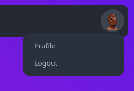

<p align="center">
  
  <h1 align="center">QUEUE OVERFLOW</h1>
</p>


## Instalation

Make sure that you have node installed before attempting to run this project. After you installed node, you can run the bellow command in the root folder of the project to install all of the dependencies.

```bash
$ npm install
```

You also need to have the backend instance running and reachable from the device. Once you have everything running, you can run the following command to start the vite service on port 3000.

```
$ npm run dev 
```
Now the webpage should be available on localhost:3000.

## Structure

The project was built with vue 3. Every vue 3 project has a main document, where the app is assembled. This particular app was built using the typescript language, and therefore, all sources are written in typescript and transpiled to Javascript on run.

### App.vue

In vue 3, the webpage is structured on components. Components can have subcomponents and so on creating a tree like structure of HTML code combined with localized typescript code.

The root component of any vue app is the App component. This component is instantiated in the main.ts file and mounted onto the index.html.

The root component contains the main view of the application and it acts as a frame, where components which appear on all pages are created, for instance, the navbar component.

<p align="center">

<p/>

In the app component, we also set up the routing system which will handle the transitions between pages. This is done through the `<router-view>` component which will replace its child with the current page.

Here, we also create the modal components like the update answer dialog which does not really belong to any component in particular and should be treated as an independent component spawned when needed. The component is made visible to the user when any part of the application requires it.

## Pages

The app contains several pages for displaying content. Each page is in essence a vue component, containing its own mostly isolated logic for displaying the model it is supposed to, or fulfilling its functionality.

### Login

The first component any user meets is the login page, where he can type in his credentials and he can log in to the system. This page has a sub-component which is the login dialog where the user can enter his email and password and he can press the login button to send a request to the backend and receive back a token which verifies his identity. This token will be persisted in our `AuthService` which will be tasked with providing identity related information to our app. For example, the navbar has an icon for the user where he can access his profile or log out. This icon is only visible when the user is logged in, so we can look towards the `Auth service` to provide our app with the flag if the user is logged in or not.

<p align="center">

<p/>

### Home

Once the user is logged in, we enter the home page of our app where we can see all the questions asked on the site in order of their creation. When this page is loaded, the Home page logic makes calls the load questions function on the `Questions Service` and awaits for the questions to come from the backend. It also takes the reference of the array of questions and will build a `QuestionCard` component for each question in the array.


<p align="center">

<p/> 

Above the list of questions there is a text field input where the user can type any question or any tag and can search it in the backend of our app. Besides this input there is the `ASK NEW` button which once clicked will open a new card which contains several inputs to create a new question on the site. Once the question is created, it will appear in the list.


<p align="center">

<p/> 

In the bottom left input, the user can type in any tag he wants to add to the question. While he types, a list of recommendations appears underneath with already existing tags in the database. He can click the arrow button, and the tags for the question will appear as chips to the right. If he wishes to remove a tag, he can click the X button in the left part of any chip.

<p align="center">

<p/> 

### Search

The user can also search questions in the database. He can either type a keyword contained in the title of the question or he can start his search with the `$` character in order to search for a particular tag.

Once he hits the search button he will be taken to the search page where a list of the results will be displayed:

<p align="center">

<p/> 

<p align="center">

<p/> 

### Question

The question page is meant to display a single question and all of its answers. It will have a detailed view of the question asked, the text, the author and the tags associated with it. Underneath, there exists a card which users can use to add an answer to the question and underneath that card are all the previous answers.

If any of the answers was created by the current user, to its right are two buttons for editing and deletion of the answer. The user can like and dislike a question or any answers which are not his.

<p align="center">

<p/> 

The page has the URL of `localhost:3000/question/5` where question denotes the page we are on and 5 is the id of the viewed question. On load, this page will ask the `Questions Service` to provide it with a Question object to display. The service will then ask the backend for the question and will return all the information on it, including the answers by all the users. Then, for each answer and for the question, it will perform a query to see if any of the answers or questions are liked by the current user and will display the like and dislike buttons accordingly.

### Profile

On the previous page, the user can click on the little card in the right of the question with the information of the author and they will be taken to the profile page. Like in the previous page, the id of the viewed user is present in the url, so even if the user views his own profile page, he will only be viewing the page with his ID.

Here you can see the "clout" which is the score of the user as well as his role. Moderators will have their role colored in green. Every user has a profile picture which is randomly generated based on their email.

<p align="center">

<p/> 

> In a future update, the user will be able to set their NFT as their profile picture.

The users can also go to the top right image of themselves and access their profile through the `profile` button.

<p align="center">

<p/> 

All the users are provided by a `UsersService` which has the task to fetch and make available the user objects from the backend.

## Styling

The styling of the app was created using tailwind css which exposes a set of classes meant to be used as building blocks for styling a webpage and to avoid having to write all the scss or sass yourself. Besides this, a component library built with tailwind css was used for the main components like cards, avatars, buttons and inputs styling.

### Services

The services used in the app are global state singletons which are lazily created when the app needs state which exceeds the scope of the components. These services are accessible from any component and are a good way to share state amongst the application tree. Many of the used services have been mentioned accross the document, with the exception of the edit service, which has the role of providing a shared state between the entities which are editable and their encapsulating components and the editing modals. The user can edit any of his answers. When he clicks the edit button, he will be prompted with a dialog where he can modify the text.

<p align="center">

<p/> 

# API CONNECTION

The connection with the backend is done through the `ApiClient` class which makes use of a request library called Axios. Through this library, we can set our auth token and perform requests from a higher level of abstraction. We only need to call a function and pass a body and the library will take care of the proper encoding of the body, or the setting of the headers. 

However, the more interesting part is the decoding of the answer. To construct our entities from the Json response, we use the `class-transformer` library which exposes some handy decorators for building our entities. For example we may mark some attributes with the `@expose` decorator and the library will know it must map any json field with the same name to that attribute.

```ts
  @Expose()
  id: number;

  @Type(() => User)
  author: User;

  @Expose()
  title: string;

  @Expose()
  text: string;

  @Type(() => Date)
  createdAt: Date;

  @Type(() => Tag)
  tags: Tag[];
```

We can also mark attributes with a `@Type` decorator in order to tell the transformer that it should apply that entities transformer in order to parse this object. This way, we can transform embedded objects into composed classes.

Class transformer was also used on the backend to map entities to json format and back.
